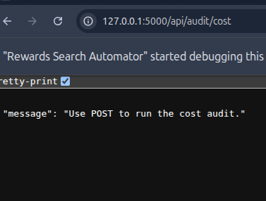
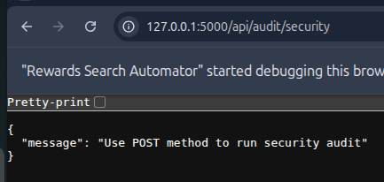
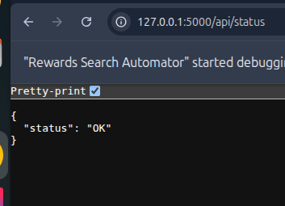
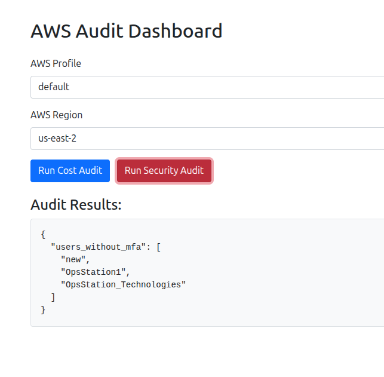
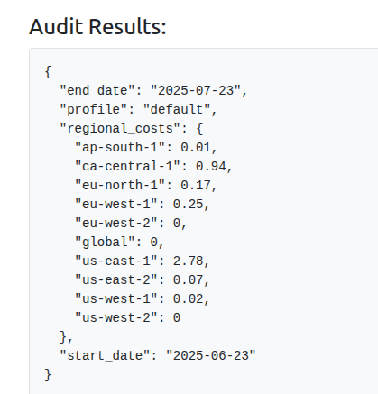

# AWS Audit Dashboard

## Features
- Cost & Security AWS Audits
- 
- 
- Flask-based API
- 
- Bootstrap-powered Web Dashboard
- 
- Report Export to JSON

## Run Locally

```bash
git clone <repo>
cd aws_audit_dashboard
python -m venv venv
source venv/bin/activate
pip install -r requirements.txt
python run.py
